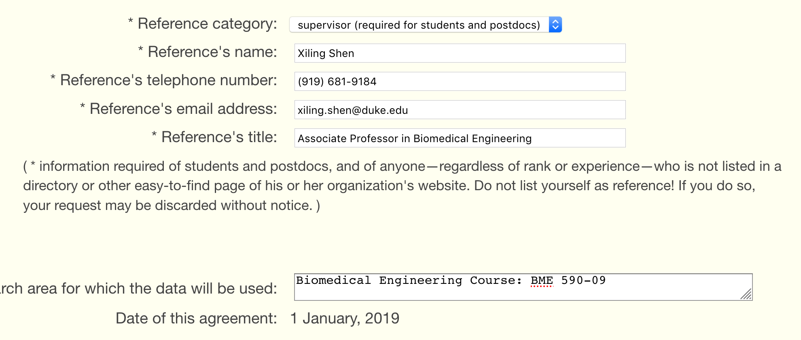

# Physionet and MIMIC-III
Michael Gao

## Welcome!

Welcome to Data Science and Health! In this class, we will be exploring some of the fundamentals of data science and apply them to various health and healthcare datasets. As you will see in this course, there are many potential applications of data science techniques in healthcare. However, one of the many difficulties of fully realizing the potential of these techniques is access to data. The main privacy law surrounding health care data is known as HIPAA or the Health Insurance Portability and Accountability Act of 1996. 

#### What is HIPAA?

HIPAA is a law that protects the privacy of medical information in the United States. It prevents the misuse of medical data and makes it difficult for the dissemination of health information. For a summary of the main points of this law, you can read more [here](https://www.hhs.gov/hipaa/for-professionals/security/laws-regulations/index.html).

### Dataset for this course

Given that there are many privacy concerns around health data, we need to go through some regulatory steps before we can work with data for this course. Luckily, the MIMIC-III database exists, and can be accessed via Physionet. **Your task for this assignment is to complete registration so that you can complete subsequent assignments in this course.** 

#### MIMIC-III

MIMIC-III (‘Medical Information Mart for Intensive Care’), according to [the MIMIC publication](https://www.nature.com/articles/sdata201635), is a large, single-center database comprising information relating to patients admitted to critical care units at a large tertiary care hospital. Data includes vital signs, medications, laboratory measurements, observations and notes charted by care providers, fluid balance, procedure codes, diagnostic codes, imaging reports, hospital length of stay, survival data, and more. The database supports applications including academic and industrial research, quality improvement initiatives, and higher education coursework.

## How to get access: (Your homework)

Follow the instructions located [**HERE**](https://mimic.physionet.org/gettingstarted/access/). If you have a question regarding this step, please don't hestitate to email us.

**PLEASE** make sure that you follow the steps located above as closely as possible. Here are things to watch out for when submitting your application:

 * Failure to submit a CITI certificate (showing only course completion) rather than a full completion report (with a list of modules, dates, and scores).

After you have completed the CITI training for the course, you will need to download a pdf file of your course completion report. Please make sure to select the CORRECT choice as shown below:

Once you have done this, download the resulting pdf. This is what you will upload to the physionet application. 

 * Failure to fill out the form completely, with supervisor's information and with research summary that includes course name and number.

 * Failure to proofread and fix errors, especially those caused by browser auto-complete.

For the supervisor information portion of the Physionet application, please use the following reference:

## Submission through Sakai

After you complete the above steps, you should upload your pdf file of the CITI completion form to Sakai under the assignments tab (HW0) to receive credit for this homework. Note that this is **NOT** a replacement for submitting the physionet application. This is merely a way for us to verify that students have completed this assignment on time.

#### References
MIMIC-III, a freely accessible critical care database. Johnson AEW, Pollard TJ, Shen L, Lehman L, Feng M, Ghassemi M, Moody B, Szolovits P, Celi LA, and Mark RG. Scientific Data (2016). DOI: 10.1038/sdata.2016.35. Available from: http://www.nature.com/articles/sdata201635
